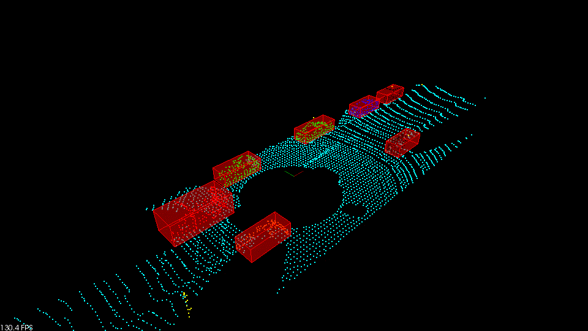

# Sensor Fusion Self-Driving Car Course

## Result

## Installation

### Linux Ubuntu 18.04

Intstall PCL 1.9.1

Use script `Ubuntu_18.04_PCL_1.9.1_install.sh`.

I checked this in my local computer with this project and it worked very well.

### Linux Ubuntu 16.04

Install PCL, C++

The link here is very helpful, 
https://larrylisky.com/2014/03/03/installing-pcl-on-ubuntu/

A few updates to the instructions above were needed.

* libvtk needed to be updated to libvtk6-dev instead of (libvtk5-dev). The linker was having trouble locating libvtk5-dev while building, but this might not be a problem for everyone.
* BUILD_visualization needed to be manually turned on, this link shows you how to do that,
  http://www.pointclouds.org/documentation/tutorials/building_pcl.php

## How To Build

`mkdir build && cd build`

`cmake ..`

`make`

`./environment`

